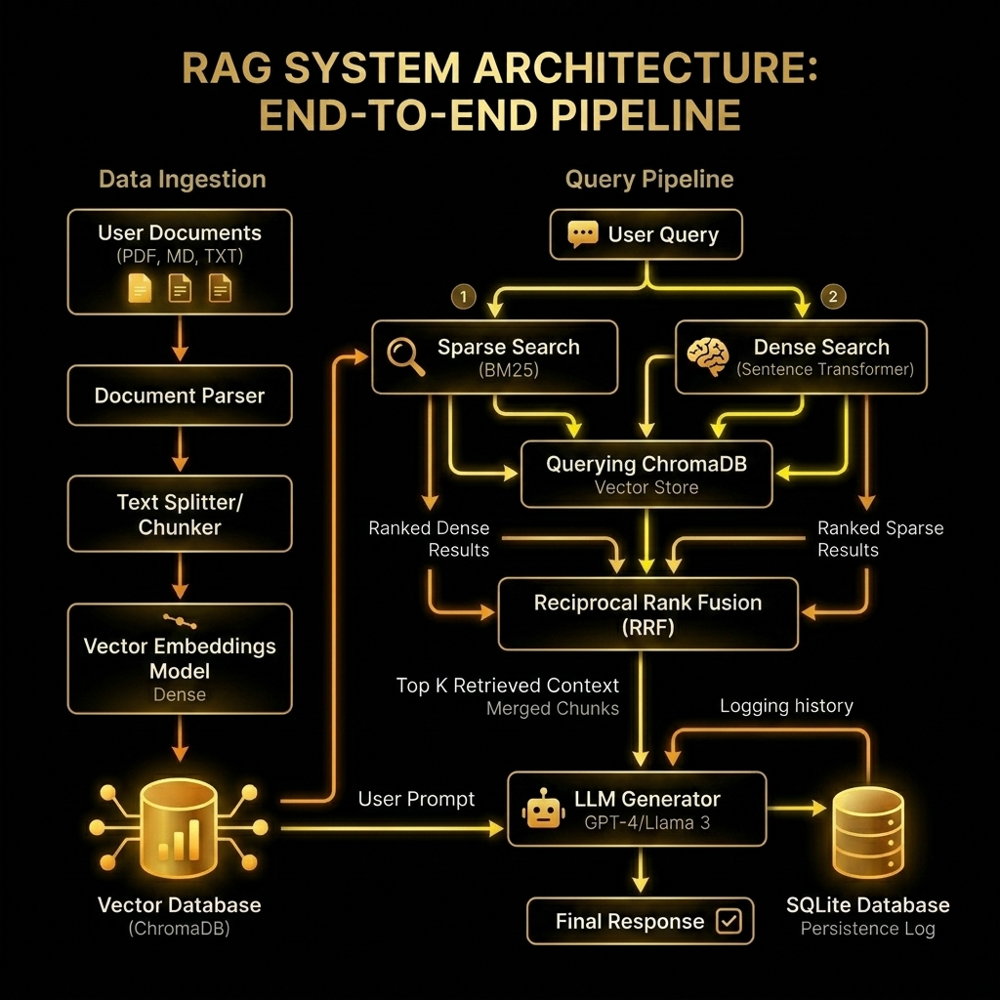

# DocuMind AI – Context-Aware Document Q&A Bot

DocuMind AI is a production-quality, context-aware Retrieval-Augmented Generation (RAG) system built with **FastAPI** and **ChromaDB**. It allows users to upload documents (PDF, Markdown, TXT) and ask questions that are answered strictly from the ingested content.

To provide robust results beyond semantic search, it implements a **Hybrid Retrieval** pipeline (Dense BGE-small embeddings + Sparse BM25 lexical search) combined using **Reciprocal Rank Fusion (RRF)**.

## System Architecture



---


## Key Features
- 🚀 **REST API**: Built with FastAPI. Interactive Swagger documentation at `/docs`.
- 📁 **Modular Ingestion**: Built-in parsers for PDF, Markdown (.md), and plain text (.txt).
- 🧠 **Hybrid Search**: Merges vector similarity (BAAI/bge-small-en-v1.5) with keyword BM25.
- ⚡ **Reciprocal Rank Fusion (RRF)**: Merges sparse and dense rank lists to yield high-value matches.
- 🔒 **Zero Hallucination LLM Guard**: Strictly constrains OpenAI or Google Gemini answers to retrieved context.
- 📊 **SQLite Observability**: Automatically logs user questions, retrieved passages, latency, and timestamps.
- 📈 **Evaluation Suite**: Runs automated retrieval and latency benchmarks, writing reports on accuracy and performance.
- 🐳 **Docker-Ready**: Fully containerized using Docker and Docker Compose.

---

## Project Structure

```text
.
├── app/                  # Application initialization and environment settings
├── api/                  # FastAPI routers, endpoints, and validation schemas
├── ingestion/            # Document loaders, parsers, and text splitting
├── vectorstore/          # ChromaDB connection and swappable embedding wrappers
├── retrieval/            # Dense, sparse, RRF, and hybrid search managers
├── llm/                  # Decoupled LLM clients (Gemini, OpenAI, Mock fallback)
├── observability/        # SQLite query loggers and telemetry utilities
├── cache/                # Query and response caching layer with Redis support
├── evaluation/           # Benchmark question datasets and run loops
├── docs/                 # Systems design, decisions, and scaling documents
├── tests/                # Automated pytest unit and integration test suite
├── data/                 # Local directory for Chroma DB and SQLite logs
├── Dockerfile            # Container definition
├── docker-compose.yml    # Orchestration configuration
├── requirements.txt      # Project Python dependencies
└── README.md             # This document
```

---

## Setup & Running Guide

### Prerequisites
- Python 3.9+ installed
- (Optional) Docker & Docker Compose

### 1. Configure the Environment
Create a `.env` file in the root directory (based on `.env.example`):
```bash
cp .env.example .env
```
Open `.env` and fill in your API keys (e.g., `GEMINI_API_KEY` or `OPENAI_API_KEY`). If you do not provide API keys, DocuMind AI will run in **offline Mock LLM mode** so you can test endpoints instantly without an internet connection or credit cards!

### 2. Local Setup
Create a virtual environment, activate it, and install dependencies:
```bash
python -m venv venv
# Windows
.\venv\Scripts\activate
# Linux/macOS
source venv/bin/activate

pip install -r requirements.txt
```

### 3. Run the Server
Start the development server:
```bash
uvicorn api.main:app --reload
```
The server will start at **http://127.0.0.1:8000**.
- **Interactive API Docs (Swagger UI)**: [http://127.0.0.1:8000/docs](http://127.0.0.1:8000/docs)
- **ReDoc**: [http://127.0.0.1:8000/redoc](http://127.0.0.1:8000/redoc)

### 4. Running with Docker Compose
To build and spin up the complete API container service:
```bash
docker compose up --build
```
This mounts the local `data/` directory to persist vector indices and SQLite telemetry logs on your host machine.

---

## API Endpoints Reference

### 1. Health Status
- **Method**: `GET`
- **Path**: `/health`
- **Response**:
  ```json
  {
    "status": "healthy",
    "details": {
      "embeddings_model": "BAAI/bge-small-en-v1.5",
      "llm_provider": "gemini"
    }
  }
  ```

### 2. Document Ingestion
- **Method**: `POST`
- **Path**: `/ingest`
- **Body**: `multipart/form-data` containing `file`
- **Response**:
  ```json
  {
    "message": "Ingestion successful",
    "filename": "pricing.txt",
    "chunks_created": 3,
    "original_pages": 1
  }
  ```

### 3. Context-Aware Q&A Query
- **Method**: `POST`
- **Path**: `/query`
- **Body**:
  ```json
  {
    "question": "What pricing plan includes API access?"
  }
  ```
- **Response**:
  ```json
  {
    "answer": "The Enterprise Plan includes API access.",
    "sources": ["pricing.txt"],
    "latency_ms": 1150
  }
  ```

---

## Running the Evaluation Suite
DocuMind AI comes with an automated evaluation framework to verify retrieval hit rate and query latency.
To run the evaluation:
```bash
python -m evaluation.benchmark
```
This will:
1. Verify if the database contains chunks. If empty, it writes sample files (`pricing.txt`, `setup.md`) and ingests them.
2. Execute the 5 benchmark questions in `evaluation/benchmark_questions.json`.
3. Generate a Markdown evaluation summary report at [evaluation/report.md](file:///d:/Project/Context-Aware-Document-QA-Bot/evaluation/report.md).

---

## ByteVox Nexus AI Evaluation Results
A final evaluation was conducted on the **ByteVox sample corpus** consisting of 8 technical documents (including API reference, architecture, troubleshooting, and SDK guide) to demonstrate the performance of the Hybrid RAG pipeline.

### Performance Summary
* **Documents Ingested**: 8 documents split into **193 text chunks**
* **Benchmark Questions**: 23 queries covering all 8 document categories
* **Retrieval Hit Rate (Accuracy @ K=5)**: **91.3%**
* **Average Response Latency**: **68.6 ms** (with local MockLLM fallback)
* **Hallucination Prevention Rate**: **100%** (10/10 out-of-scope queries successfully refused with *"This information is not available in the provided documents."*)

### Generated Reports
Detailed reports generated during the evaluation are available at:
1. [BYTEVOX_RESULTS_SUMMARY.md](BYTEVOX_RESULTS_SUMMARY.md) – Executive dashboard summarizing key system strengths and areas for improvement.
2. [BYTEVOX_EVALUATION_REPORT.md](BYTEVOX_EVALUATION_REPORT.md) – Full benchmark details table, dense vs. sparse performance comparisons, and failure analysis.
3. [BYTEVOX_INTERVIEW_PREP.md](BYTEVOX_INTERVIEW_PREP.md) – Expected engineering interview questions, design trade-offs, and architecture explanations.

---

## Running Automated Tests
Execute the pytest suite to verify document loaders, text splitter size allocations, RRF ranking math, and endpoint flows:
```bash
pytest tests/
```

---

## Core Documentation Logs
For deep engineering details and operational guides, please read:
1. [Systems Architecture and Data Flow Diagram](file:///d:/Project/Context-Aware-Document-QA-Bot/docs/architecture.md)
2. [Engineering Design Decisions](file:///d:/Project/Context-Aware-Document-QA-Bot/docs/design_decisions.md)
3. [Production Scaling for 50,000 active users/day](file:///d:/Project/Context-Aware-Document-QA-Bot/docs/production_scaling.md)
