# DocuMind AI - System Architecture

DocuMind AI is built using clean, modular architecture principles. The system decouples document ingestion, vector storage, search retrieval, and LLM text generation to ensure maintainability, testing convenience, and performance optimization.

## System Flow Diagram

The diagram below shows the end-to-end data flow for both **Document Ingestion** and **Hybrid Retrieval Q&A Queries**:

```mermaid
graph TD
    %% Ingestion Pipeline
    subgraph Ingestion Pipeline
        A[User Document: PDF, MD, TXT] --> B[load_document Parser]
        B --> C[RecursiveCharacterTextSplitter]
        C --> D[Generate Chunks with Metadata]
        D --> E[ChromaVectorStore add_documents]
        E --> F[Persist to data/chroma]
    end

    %% Query Pipeline
    subgraph Q&A Query Pipeline
        G[User Query] --> H[FastAPI Endpoint /query]
        H --> I[HybridRetriever retrieve]
        I --> J[Dense Retrieval Chroma BGE]
        I --> K[Sparse Retrieval BM25]
        J --> L[Dense Ranked List]
        K --> M[Sparse Ranked List]
        L --> N[Reciprocal Rank Fusion RRF]
        M --> N
        N --> O[Top-K Fused Context Chunks]
        O --> P[RAGGenerator generate_response]
        P --> Q[LLM Gemini / OpenAI / Mock]
        Q --> R[Format Final Answer & Sources]
        R --> S[SQLiteLogger log_query]
        R --> T[Return Response to User]
        S --> U[Persist to data/logs.db]
    end
```

## Module Breakdown

1. **API Layer (`api/`)**:
   - Built on FastAPI. Exposes REST endpoints (`/health`, `/ingest`, `/query`).
   - Uses Pydantic schemas to validate data inputs and outputs.
   
2. **Ingestion Layer (`ingestion/`)**:
   - Decoupled document loaders read plain text, parse headings in Markdown, and extract page contents page-by-page from PDFs.
   - Text splitter recursively breaks down texts on paragraphs, sentences, and words to maintain cohesive chunks.

3. **Vector Database Layer (`vectorstore/`)**:
   - Manages connection to ChromaDB.
   - Encapsulates Hugging Face `BAAI/bge-small-en-v1.5` embeddings via a custom wrapper.

4. **Retrieval Layer (`retrieval/`)**:
   - Decouples Dense Search (embeddings semantic similarity) and Sparse Search (BM25 keyword match).
   - The `HybridRetriever` co-ordinates index syncing and calls both search paths, executing Reciprocal Rank Fusion (RRF) to merge ranks.

5. **LLM Generation Layer (`llm/`)**:
   - Decouples API client interactions (OpenAI vs Gemini) using an abstract base class.
   - Enforces strict context-constraint prompts to block hallucinations.
   - Hosts a local `MockLLM` fallback for running query pipelines offline or during CI/CD checks.

6. **Observability Layer (`observability/`)**:
   - Employs local SQLite databases to capture log telemetries (latency, sources, answers, timestamps) for audit trails and dashboard analytics.
