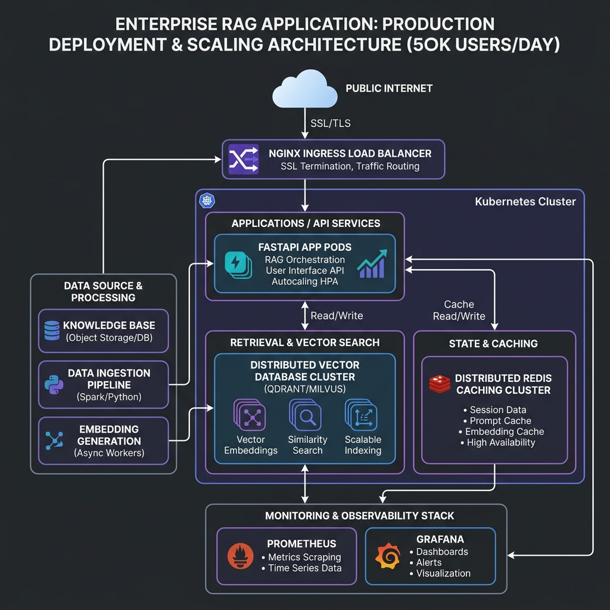

# Production Scaling & Deployment Strategy (50,000 Users/Day)

This document provides a scaling blueprint for deploying DocuMind AI in a production environment serving **50,000 active users per day**.

Based on 50,000 users/day, assuming an average of 10 queries per user spread across standard business hours, the system should handle:
- **Average QPS**: $\approx 6$ queries per second (QPS).
- **Peak QPS**: $\approx 30$ to 50 queries per second (QPS) during high-concurrency windows.



---


## 1. API & Load Balancing Layer

### FastAPI Workers
- **Current setup**: Single Uvicorn process.
- **Production Scale**: Use **Gunicorn** as a process manager with Uvicorn workers (`UvicornWorker` class).
- **Formula**: $2 \times \text{Number of CPU Cores} + 1$ worker processes per container.
- **Asynchronous Execution**: Leverage FastAPI's `async` endpoint support for non-blocking I/O operations (like fetching S3 files or logs).

### Load Balancing & Ingress
- Deploy an **NGINX** or **HAProxy** load balancer as the entrypoint.
- **Responsibilities**:
  - **SSL/TLS Termination**: Keep CPU workloads away from Python workers.
  - **Rate Limiting**: Block abuse using NGINX rate-limiting zones (e.g., limit to 5 requests/sec per IP, with a burst of 10).
  - **Keep-Alive Connections**: Optimize connection reuse to reduce TCP handshake overhead.

---

## 2. Distributed Caching (Redis)

To handle 50,000 users/day, caching is the single most effective way to protect LLM budgets and database capacity.

```
                  +-----------------------+
                  |  FastAPI Query Route  |
                  +-----------+-----------+
                              |
                     (Check Cache Key)
                              |
                    +---------v---------+
          +--------->    Redis Cache    +---------+
          |         +-------------------+         |
      Cache Hit                               Cache Miss
          |                                       |
+---------v---------+                   +---------v---------+
| Return cached     |                   | Run Hybrid        |
| response instantly|                   | Search & LLM      |
+-------------------+                   +---------+---------+
                                                  |
                                            (Cache Result)
                                                  |
                                                  v
```

### Cache Strategy
- **Exact Match Cache**: Use Redis to store md5 hashes of the user query strings.
- **Cache Content**: Save serialized JSON structures of responses (answer + source metadata).
- **TTL Configuration**: Use a Time-To-Live (TTL) of 24 hours for dynamic docs, or longer for static manuals.
- **Semantic Caching (Advanced)**: Store query embeddings in Redis (using Redis VL) and check for semantic cosine similarity $> 0.96$ to catch paraphrased questions.

---

## 3. Vector Database Scaling

### Moving from Chroma Local to Distributed Vector Stores
- Local SQLite-backed ChromaDB is not suitable for multi-node deployments because it cannot sync state across multiple containers.
- **Production migration**: Swap ChromaDB for a dedicated vector database cluster like **Qdrant**, **Milvus**, or **Pinecone**.
- **Qdrant Cluster Setup**:
  - Deploy Qdrant in distributed mode (using consensus protocols like Raft).
  - **Replication**: Setup a replication factor of 2 or 3 to allow high availability.
  - **Read/Write Segregation**: Direct write traffic (ingestion) to primary nodes and route search queries to read-replicas.

### Search Optimization
- **HNSW Index Tuning**: Configure `m` (max links per node) and `ef_construct` (construction search depth) to balance search accuracy and index speed.
- **Payload Filtering**: Apply metadata filters (e.g., document owner, timestamp) during vector search to bypass scanning the entire index.

---

## 4. Kubernetes (EKS/GKE) Orchestration

Deploy the application inside Kubernetes to handle scaling and high availability automatically.

### Pod Autoscaling
- Setup a **Horizontal Pod Autoscaler (HPA)** based on target CPU utilization ($>70\%$) and concurrency metrics.
- Maintain a minimum replica count of 3 across multiple Availability Zones (AZs) for high availability.

### Resource Limits and Requests
```yaml
resources:
  requests:
    cpu: "1"
    memory: "2Gi"
  limits:
    cpu: "2"
    memory: "4Gi"
```
- Limit CPU bounds to prevent single-thread Python workers from starving sister containers.
- Set memory requests high enough to hold the BGE embedding model in RAM without triggering Out-Of-Memory (OOM) kills.

---

## 5. Monitoring & Observability

Deploy a centralized Prometheus and Grafana stack to track system health.

### Key Metrics to Monitor
1. **RAG Latency Percentiles**: Track p50, p90, and p99 latencies for `/query`.
2. **Retrieval Hit Rate**: Percentage of queries where dense + sparse retrieval returns relevant context.
3. **Cache Hit Rate**: Ratio of cache hits vs. total queries. Protects against database overload.
4. **Token Usage & Costs**: Monitor prompt and completion token counts to manage API budgets.
5. **System Metrics**: Monitor CPU/RAM consumption of API pods and vector DB nodes.

### Centralized Logging
- Stream container logs (stdout/stderr) to a centralized logging system like **Grafana Loki** or the **ELK Stack** (Elasticsearch, Logstash, Kibana).
- Implement distributed tracing using **OpenTelemetry** with **Jaeger** to map trace IDs across endpoints, vector stores, and external LLM APIs.

---

## 6. Cost & Latency Optimizations

### Cost Control
- **Prompt Pruning**: Limit context size. Re-rank and return only the top 3 high-value chunks rather than a blanket top 10.
- **Model Routing**: Direct simple queries (e.g., greetings, status checks) to lightweight models (e.g., Gemini 1.5 Flash or GPT-4o-mini), reserving larger models for complex logic.

### Latency Reduction
- **Embedding Quantization**: Use scalar quantization (convert float32 embeddings to int8) to reduce vector memory footprints by $75\%$ and speed up search speeds.
- **Async LLM streaming**: Stream completions from the LLM back to the client using Server-Sent Events (SSE) to reduce time-to-first-token (TTFT).
